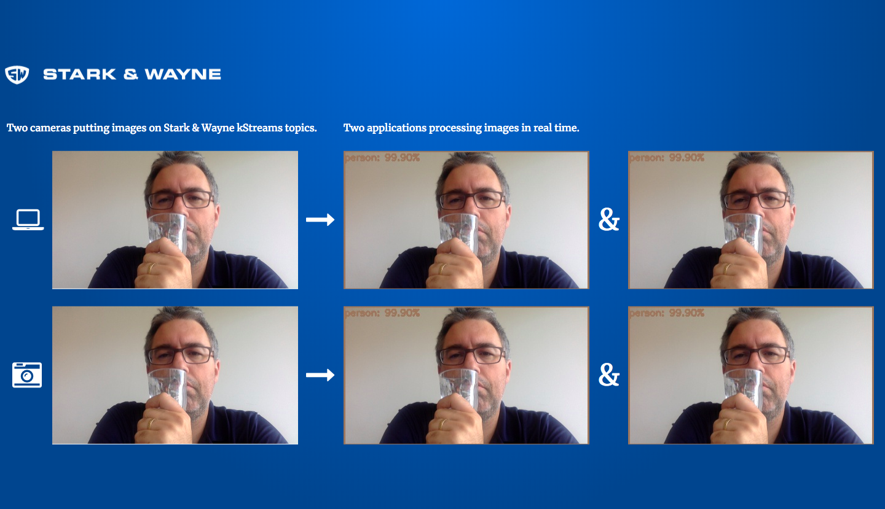

# Demo of Kafka and OpenCV



## Locally MacOS

```
brew install kafka librdkafka
```

Kafka + ZooKeeper are now running locally.

To start publishing your laptop camera to a kafka topic:

```
cd imagesfromopencv-to-kafka
CAMERA=opencv python3 app.py
```

To start processing the images from Kafka topic via OpenCV to do object detection, and push the resulting images onto a new Kafka topic:

```
cd objectdetector
python3 app.py
```

To run a webserver that streams the resulting images to a web page:

```
cd imagewatcher
gunicorn __init__:app --reload -e CAMERA=kafka
```

View at http://localhost:8000

## MacOS/tmux

```
brew install tmux
gem install tmuxinator
```

There is a local `.tmuxinator.yml` that will now start zookeeper/kafka, and then run all the different processes:

```
tmuxinator start demo
```

To exit the tmux session, use tmux command `ctrl-c d`. Then to kill the session and its processes:

```
tmux kill-session -t demo
```

## Cloud Foundry

To deploy all apps to Cloud Foundry:

```
bin/deploy.sh
```

If an application fails to run and has the following in its logs, then perhaps Kafka cluster is unhealthy:

```
2017-11-10T16:44:39.16+1000 [APP/PROC/WEB/0] ERR [2017-11-10 06:44:39 +0000] [6] [CRITICAL] WORKER TIMEOUT (pid:43)
2017-11-10T16:44:39.16+1000 [APP/PROC/WEB/0] ERR [2017-11-10 06:44:39 +0000] [43] [INFO] Worker exiting (pid: 43)
2017-11-10T16:44:39.19+1000 [APP/PROC/WEB/0] ERR [2017-11-10 06:44:39 +0000] [141] [INFO] Booting worker with pid: 141
```
